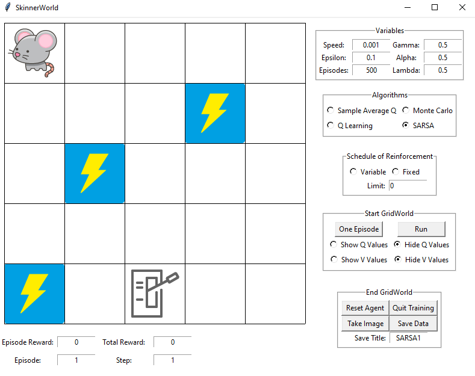
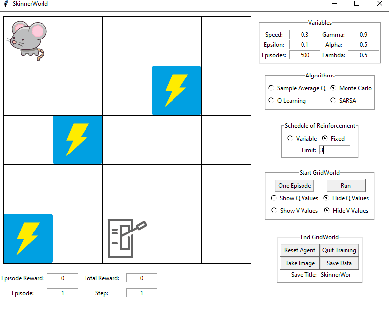
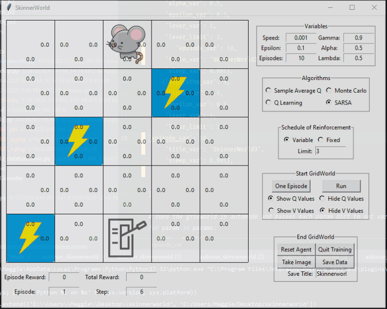
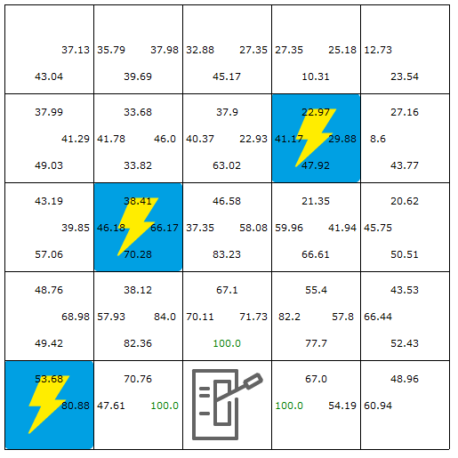

# SkinnerWorld

SkinnerWorld is a reinforcement learning gridworld project based on a [Skinner Box](https://www.verywellmind.com/what-is-a-skinner-box-2795875)

Four algorithms are implemented: Sample Averaging, Monte Carlo, Q learning, and SARSA.

Gridworld is implemented with a tkinter GUI

All parameters and algorithms can be defined as user inputs on the GUI or as parameters when initializing the gridworld.

The agent starts in the left upper corner. Blue spaces have reward = -20, all other spaces have reward = 0.

The goal of the agent is to get to the lever and press it the required number of times to recieve reward. 

Lever pressing action is indicated by the lever moving animation. 

If the lever lights up, the agent needs to press the lever one more time for the reward. 

The cheese image indicates reward was recieved. 

Lever press reward = 100. After the agent receieves reward, the episode is over and he returns to the starting state in a new episode.

[Schedules of reinforcement](https://www.verywellmind.com/what-is-a-schedule-of-reinforcement-2794864) indicate how many behavioral responses (lever presses) the agent needs to complete to recieve reward. 

They can be implemented in SkinnerWorld by changing the parameters on the screen.

Fixed schedules will set the required lever presses to the limit specified. 

Variable schedules will pick a random number between 1 and the limit specified, each new episode will determine the required lever presses for that episode.

main.py demonstrates the main driver for SkinnerWorld.

autorun_skinnerworld.py demonstrates how variables can be preset and run through an autoloop. 

The "Save Data" button will create and pickle the AgentData class that will store the Q and V tables and selected variables for later analysis.

The "Take Image" button will generate and save screenshots of the Q table and V table. For screenshots to work properly, ensure the display settings of your monitor is set to 100%.

## Authors

* **Maggie Elkin** 

